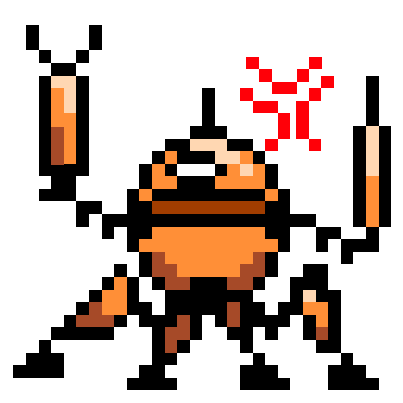

  

# FRICK IT
Action platformer made with Unity

## So, What’s The Sitch?
In this game you will play as a state-of-art bot with the task to maintain the supercomputers in the scientific facility. Unfortunately, the bot’s AI is so advanced it came to despise its job on the very first day. Help the bot vent its frustration by destroying the whole workplace. But be careful, because other bots can and will fight back.

## How to play
10 supercomputers and 9 colleagues to destroy. Get rid of everything and you are a winner.

- WAS/Arrow keys = Move
- E = Destroy a supercomputer
- Cursor = Aim
- Left click = Shoot

## Known bugs
The state bar that appears above the player when they break a supercomputer can go over its threshold.

## Credits
Font
- PixelSix by Cal Henderson on dafont.com
